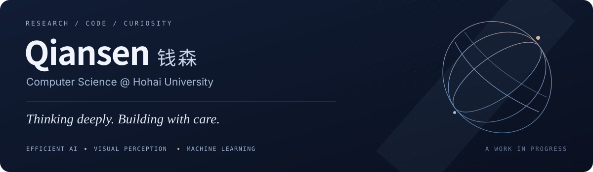

  

  <a href="https://github.com/qiansen0809-droid">English</a> · <a href="https://github.com/qiansen0809-droid/qiansen0809-droid/blob/main/README.zh-CN.md"><b>中文</b></a>
  &nbsp;&nbsp;/&nbsp;&nbsp;
  <a href="#my-journey">My journey</a> · <a href="#research-focus">Research</a> · <a href="#selected-projects">Projects</a> · <a href="#contact">Contact</a>

## About me

你好，我是 **钱森（Qian Sen）**，河海大学计算机科学与技术专业本科生。

目前关注 **大模型推理优化**，重点探索 KV Cache 压缩、注意力头预算分配与多任务缓存复用。也参与无人机环境感知、学生行为建模与音频身份识别项目，喜欢从具体问题出发，把想法落实到代码与实验中。

## My journey

我身上最大的特点是永不言败、坚强、有毅力。

高考的严重失利，曾让我与理想中的高校失之交臂。但我没有因此自暴自弃，也不愿用一次考试的结果定义自己。我选择继续努力学习，一点点充实自己。

大一时，我在河海大学物联网工程（IoT）专业排名第一。出于对计算机科学与技术的热爱，我选择转入计算机专业，去学习自己真正喜欢的东西。

大二这一年，我用一年时间修读了原本分布在大一、大二两年的课程，取得了**学年绩点排名 2/210、累计绩点排名 3/210** 的成绩，在所有转入计算机专业的同学中，学业成绩位列第一。直到大三，我才终于补完转专业需要补修的所有课程，有了些许喘息的机会。

大二升大三的暑假，出于对科研的热爱，我加入了本校的边缘智能课题组。我先花了一个星期，通过阅读综述和经典论文，逐步建立起对大语言模型的基础认识，再循着自己的兴趣，选择 **KV Cache 缓存优化** 作为进一步钻研的方向。

接下来的一个月，我围绕驱逐、合并、量化和预算分配等方法，阅读了六十余篇论文，覆盖 2024 年以来这一领域的核心工作，其中约十篇进行了更深入的精读。那段打基础的日子，我每天从早上六点读到晚上十点，几乎把所有的时间都投入到学习里。

> 我可能并不是一个有着出色起点的学生，但我相信勤能补拙，相信踏踏实实做事一定会有所回报。我也希望，有一天能靠自己的不懈努力，在计算机领域闯出属于自己的一片天地。

## Research focus

> **如何在有限的缓存预算下，保留真正重要的信息？**

`KV Cache compression` &nbsp; `Head-wise allocation` &nbsp; `Efficient inference`

围绕这一问题，开展相关文献阅读、代表性方法复现与实验分析，探索预算分配和缓存复用的改进思路。研究持续进行中。

## Selected projects

<table>
<tr>
<td width="50%" valign="top">
<h3>01 / KV Cache Research</h3>

<b>长上下文推理 · 缓存预算分配</b>

基于 LU-KV / kvpress 等已有工作开展方法学习、复现与实验探索，关注注意力头间的缓存资源分配。

<code>LLM inference</code> <code>KV Cache</code>

<a href="https://github.com/qiansen0809-droid/CausalDuel-KV">查看研究仓库 ↗</a> &nbsp; Research fork · 研究中

</td>
<td width="50%" valign="top">
<h3>02 / BEV Drone Project</h3>

<b>无人机仿真 · 鸟瞰环境表示</b>

基于 AirSim 采集 RGB 与深度信息，通过几何投影生成 BEV 地图，并探索 CLIP 图文编码与语义匹配。

<code>AirSim</code> <code>OpenCV</code> <code>CLIP</code>

<a href="https://github.com/qiansen0809-droid/BEV_Drone_Project">查看项目 ↗</a> &nbsp; Prototype · 原型探索

</td>
</tr>
<tr>
<td width="50%" valign="top">
<h3>03 / StudentBehavior</h3>

<b>多源校园数据 · 就业风险预测</b>

整合多源行为数据，构建特征工程、模型比较与集成学习流程，结合 K-Means 聚类分析学生行为画像。

<code>scikit-learn</code> <code>Ensemble learning</code>

<a href="https://github.com/qiansen0809-droid/StudentBehavior">查看项目 ↗</a> &nbsp; Applied machine learning

</td>
<td width="50%" valign="top">
<h3>04 / EAR Recognition</h3>

<b>深度声学表征 · 音频身份识别</b>

适配 EAR 音频数据，沿用 MFCC、TDNN 与统计池化提取 x-vector，结合 PLDA 探索身份匹配与评分。

<code>PyTorch</code> <code>x-vector</code> <code>PLDA</code>

<a href="https://github.com/qiansen0809-droid/EAR-Recognition-x-vectors">查看项目 ↗</a> &nbsp; Adaptation of existing work

</td>
</tr>
</table>

这里展示的是我的研究实践与参与项目；复现、适配和原创贡献分别说明，具体实现范围以各仓库文档为准。

## Toolbox

| 编程 | 模型与数据 | 仿真与开发 |
| :--- | :--- | :--- |
| Python · C++ · Rust | PyTorch · scikit-learn | AirSim · OpenCV · Git |

## Contact

**GitHub** · [@qiansen0809-droid](https://github.com/qiansen0809-droid)  
**Email** · [seanchian@foxmail.com](mailto:seanchian@foxmail.com)

---

Stay curious. Keep building.

